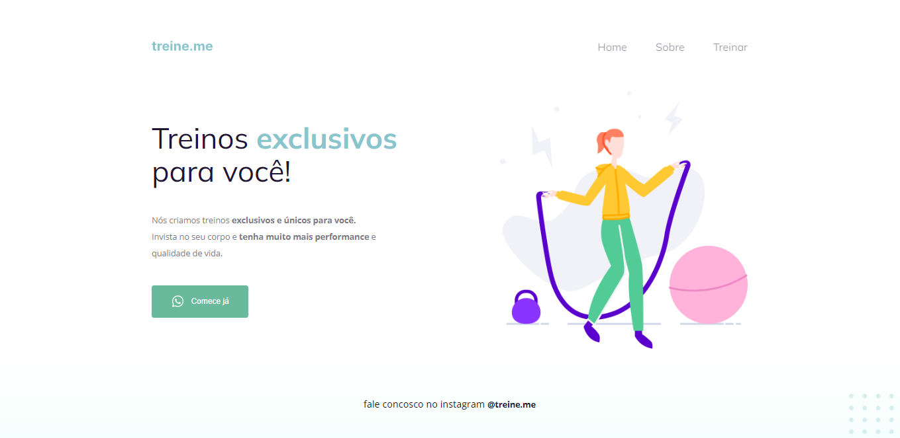

<h1 align="center"> Homepage Treinos Online </h1>

  <a href="#-tecnologias">Tecnologias</a>&nbsp;&nbsp;&nbsp;|&nbsp;&nbsp;&nbsp;
  <a href="#-projeto">Projeto</a>&nbsp;&nbsp;&nbsp;|&nbsp;&nbsp;&nbsp;
  <a href="#memo-licença">Licença</a>

  

 

  

## 🚀 Tecnologias

Esse projeto foi desenvolvido com as seguintes tecnologias:

- HTML
- CSS
- Git e Github
- Figma

## 💻 Projeto

Projeto desenvolvido na Trilha Explorer da Rocketseat. Uma homepage de uma academia que cria treinos online exclusivos e personalizados.

- [Acesse o projeto finalizado, online](https://fernandoalvesrufino.github.io/homepage-academia/)

## :memo: Licença

Esse projeto está sob a licença MIT.

---

by Fernando Rufino

> Projeto criado pela Rocketseat 